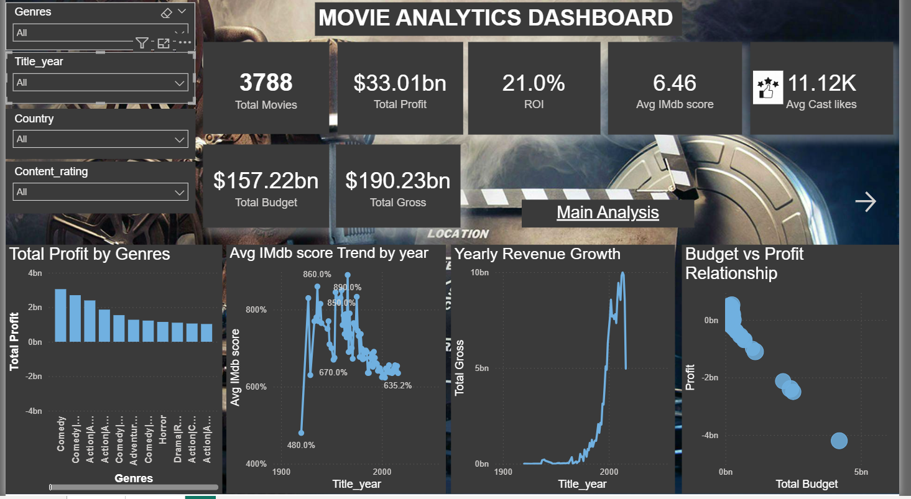
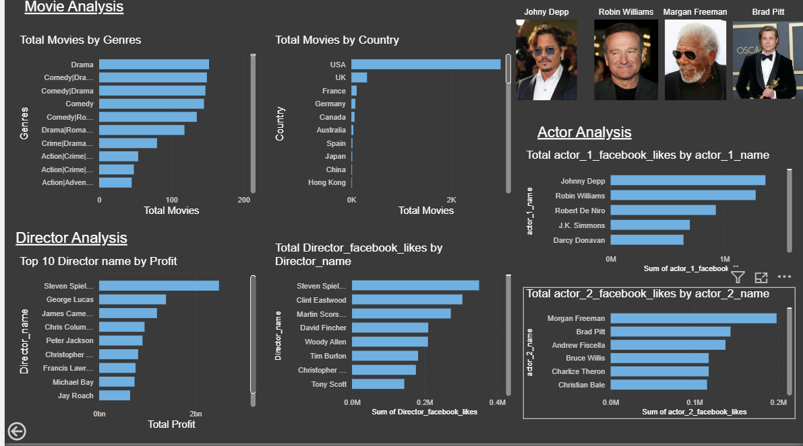

# 🎬Movie Industry Performance & Profitability Analysis
## 📊Interactive Power BI Dashboard Project

## 🚀Project Overview

This project presents an end-to-end data analysis of a movie dataset, starting with data cleaning in Microsoft Excel (Power Query) and progressing to advanced visualization in Power BI.
The raw dataset contained missing values, duplicate values and inconsistent format. Using Excel Power Query, the data was cleaned, standardized, and transformed to ensure accuracy and reliability before importing it into Power BI for modeling and analysis.  

After cleaning, the dataset was used to build an interactive dashboard that analyzes:

Movie profitability  
- Revenue and budget trends  
- Genre performance  
- Director impact on financial success  
- IMDb rating distribution     

This project demonstrates practical skills in:

- Data Cleaning using Excel Power Query  
- Data Transformation & Standardization  
- Data Modeling in Power BI  
- DAX Calculations  
Business-Oriented Data Visualization  

## 🧹Data Preparation (Power Query)

The dataset was cleaned and transformed using Power Query:  
- Create a index column named Movie_id  
- Removed duplicate records using Movie_id  
- Handled missing values in budget, gross, and IMDb score  
- Corrected data types (Year, Decimal, Whole Number)  
- Add custom column named Profit  
- Add conditional column named Profitability  
- Rearrange the columns into correct order   

This ensured accurate reporting and reliable insights.

## 📊Data Modeling & DAX Measures

Created calculated measures including:

DAX:

Total Movies = COUNT(cleaned_movie_metadata[Movie_id])

Total Gross = SUM(cleaned_movie_metadata[gross])

Total Budget = SUM(cleaned_movie_metadata[budget])

Total Profit = SUM(cleaned_movie_metadata[Profit])

Avg IMDb Score = AVERAGE(cleaned_movie_metadata[imdb_score])

Avg cast likes = AVERAGE(cleaned_movie_metadata[cast_likes])

ROI = DIVIDE([Total Profit],[Total Budget],0)

## 📈Dashboard Features  

🔹 Cards

- Total Movies  
- Total Gross Revenue
- Total Budget  
- Total Profit  
- ROI(Return On Investment)  
- Average IMDb Score  

🔹 Trend Analysis

- Gross Revenue Trend by Year (Line Chart)

🔹 Performance Analysis

- Total Profit by Genre  
- Budget vs Profit Relationship (Scatter Plot)  
- Movies by Country  
- IMDb Score Distribution  

🔹 Leadership Insights

- Top 10 Directors by Profit

🔹 Interactive Slicers

- Year
- Genre  
- Country  
- Content Rating  

## 💡 Key Insights

Certain genres consistently outperform others in profitability.  
Budget does not always correlate with higher profit.  
Industry revenue shows cyclical growth trends over time.  
Director selection plays a significant role in financial performance.  

## 🛠 Tools & Technologies

Microsoft Power BI  
Power Query  
DAX (Data Analysis Expressions)  
Data Modeling Techniques  

## 📸 Dashboard Preview

  

## 📁 Repository Structure

- 📊 [Movie_Analytics_Dashboard.pbix](Movie_Analytics_Dashboard.pbix)
- 📄 [Dataset](movie_metadata.csv.xlsx)
- 📸 [Dashboard Screenshot](dashboard.png)
- 📘 [README..md](README.md)  
## 👩‍💻 About Me

Rahana Mohzin  
Aspiring Data Analyst  
Skilled in Power BI | SQL | Excel | Python  
Currently building real-world analytics projects.  

📌 Open to entry-level Data Analyst opportunities.
